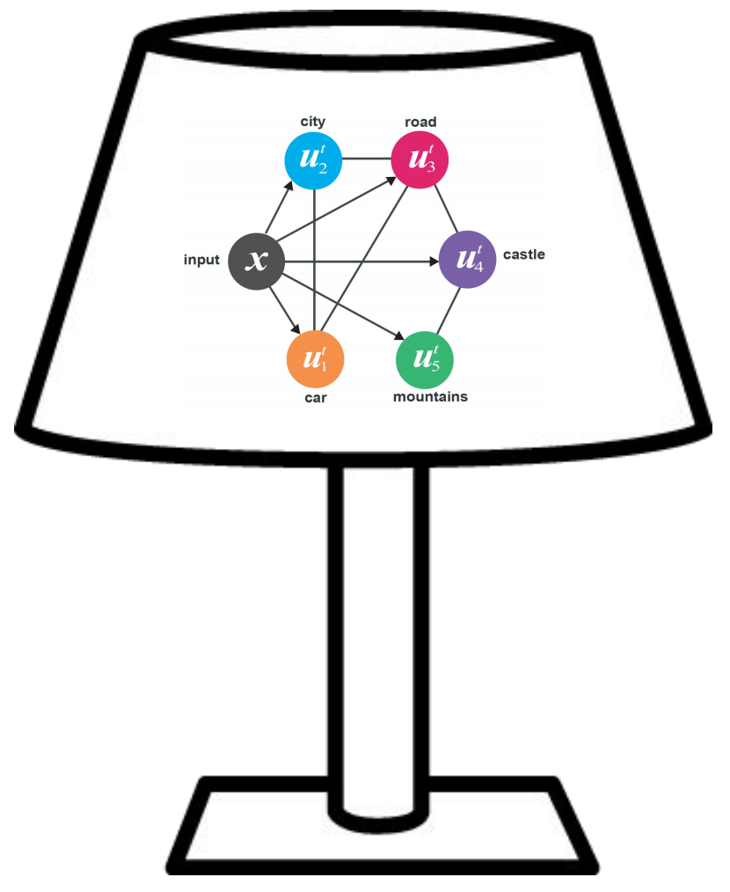

**Neural Message Passing for Multi-Label Classification**<br/>
ECML-PKDD 2019<br/>
Jack Lanchantin, Arshdeep Sekhon, Yanjun Qi<br/>
[[paper]](https://arxiv.org/abs/1904.08049)
[[slides]](https://www.cs.virginia.edu/~jjl5sw/documents/LaMP_slides.pdf)
[[poster]](https://www.cs.virginia.edu/~jjl5sw/documents/LaMP_poster.pdf)


## Requirement
- python 3.4+
- pytorch 0.2.0
- tqdm
- numpy


## Usage

### Data
Download the data from: [http://www.cs.virginia.edu/~jjl5sw/data/lamp_datasets.tar.gz](http://www.cs.virginia.edu/~jjl5sw/data/lamp_datasets.tar.gz) (745M)
```bash
wget http://www.cs.virginia.edu/~jjl5sw/data/lamp_datasets.tar.gz
```

Untar into the current directory
```bash
tar -xvf lamp_datasets.tar.gz -C ./
```

<!--
### 1) Preprocess the data for a specific dataset
```bash
python preprocess.py -train_src data/reuters/train_inputs.txt -train_tgt data/reuters/train_labels.txt -valid_src data/reuters/valid_inputs.txt -valid_tgt data/reuters/valid_labels.txt -test_src data/reuters/test_inputs.txt -test_tgt data/reuters/test_labels.txt -save_data data/reuters/train_valid_test.pt -max_seq_len 300
```
-->

### Train and Test the model (training script contains the validation and testing code)
```bash
python main.py -dataset reuters -batch_size 32 -d_model 512 -d_inner_hid 512 -n_layers_enc 2 -n_layers_dec 2 -n_head 4 -epoch 50 -dropout 0.2 -dec_dropout 0.2 -lr 0.0002 -encoder 'graph' -decoder 'graph' -label_mask 'prior'
```


## Acknowledgement
Much of this code was adapted from @jadore801120
